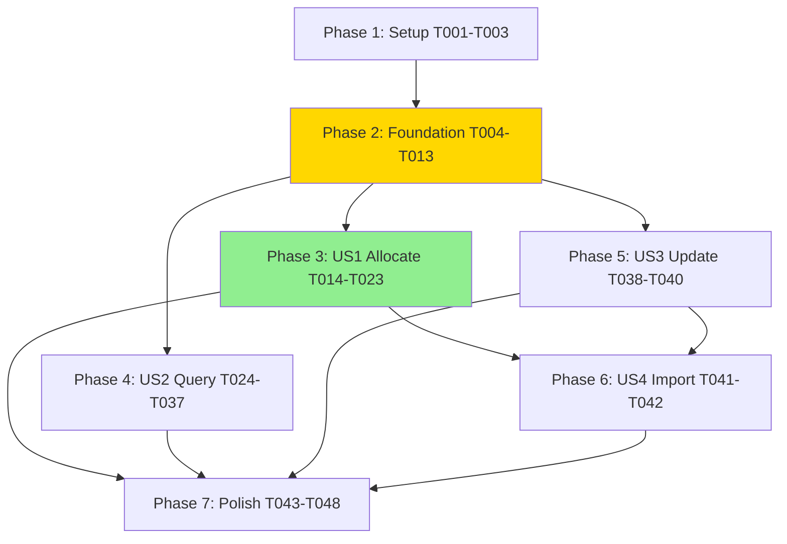

# Tasks: Floating IP Resource and Data Source

**Feature**: 007-floating-ip-resource  
**Branch**: `007-floating-ip-resource`  
**Input**: Design documents from `/specs/007-floating-ip-resource/`

---

## Format: `[ID] [P?] [Story] Description`

- **[P]**: Can run in parallel (different files, no dependencies)
- **[Story]**: Which user story this task belongs to (US1, US2, US3, US4)
- All task descriptions include exact file paths

---

## Phase 1: Setup (Shared Infrastructure)

**Purpose**: Project initialization and basic structure that all user stories depend on

- [X] T001 Create internal/vps/model/floating_ip.go with package declaration and imports
- [X] T002 [P] Add resource registration to internal/provider/provider.go Resources() method
- [X] T003 [P] Add data source registration to internal/provider/provider.go DataSources() method

---

## Phase 2: Foundational (Blocking Prerequisites)

**Purpose**: Core model definitions that ALL user stories depend on

**⚠️ CRITICAL**: No user story implementation can begin until this phase is complete

- [X] T004 Define FloatingIPResourceModel struct in internal/vps/model/floating_ip.go (6 attributes: id, name, description, ip_address, status, device_id)
- [X] T005 [P] Define FloatingIPDataSourceModel struct in internal/vps/model/floating_ip.go (4 filters + floating_ips list)
- [X] T006 [P] Define FloatingIPModel struct in internal/vps/model/floating_ip.go (nested result type with 6 attributes)
- [X] T007 [P] Implement stringPointerOrNull helper function in internal/vps/model/floating_ip.go for null handling
- [X] T008 Implement MapFloatingIPToResourceModel function in internal/vps/model/floating_ip.go (SDK → resource model conversion)
- [X] T009 [P] Implement MapFloatingIPToModel function in internal/vps/model/floating_ip.go (SDK → data source result conversion)
- [X] T010 [P] Implement BuildCreateRequest function in internal/vps/model/floating_ip.go (model → SDK CreateRequest)
- [X] T011 [P] Implement BuildUpdateRequest function in internal/vps/model/floating_ip.go (model → SDK UpdateRequest)
- [X] T012 Implement FilterFloatingIPs function in internal/vps/model/floating_ip.go (client-side filtering logic)
- [X] T013 Implement matchesFilters helper function in internal/vps/model/floating_ip.go (AND logic for filters)

**Checkpoint**: Foundation ready - user story implementation can now begin in parallel

---

## Phase 3: User Story 1 - Allocate and Manage Floating IPs (Priority: P1) 🎯 MVP

**Goal**: Enable allocation and deletion of floating IPs through Terraform resource

**Independent Test**: Create zillaforge_floating_ip resource, apply, verify IP allocated, then destroy and verify IP released

### Tests for User Story 1 ⚠️

> **TDD WORKFLOW**: Write these tests FIRST, ensure they FAIL, then implement T015-T021

- [X] T014 [P] [US1] Write TestAccFloatingIPResource_Basic in internal/vps/resource/floating_ip_resource_test.go (create without name/description, verify id and ip_address set)

### Implementation for User Story 1

- [X] T015 [US1] Create FloatingIPResource struct in internal/vps/resource/floating_ip_resource.go with client field
- [X] T016 [US1] Implement NewFloatingIPResource factory function in internal/vps/resource/floating_ip_resource.go
- [X] T017 [US1] Implement Metadata method in internal/vps/resource/floating_ip_resource.go (TypeName: "zillaforge_floating_ip")
- [X] T018 [US1] Implement Schema method in internal/vps/resource/floating_ip_resource.go (6 attributes with MarkdownDescription, plan modifiers)
- [X] T019 [US1] Implement Configure method in internal/vps/resource/floating_ip_resource.go (VPSClient setup)
- [X] T020 [US1] Implement Create method in internal/vps/resource/floating_ip_resource.go (BuildCreateRequest, CreateFloatingIP, MapToResourceModel, handle pool exhaustion errors)
- [X] T021 [US1] Implement Delete method in internal/vps/resource/floating_ip_resource.go (DeleteFloatingIP, handle not-found gracefully)

### Additional Tests for User Story 1

- [X] T022 [P] [US1] Write TestAccFloatingIPResource_WithNameDescription in internal/vps/resource/floating_ip_resource_test.go (create with name/description, verify attributes)
- [X] T023 [P] [US1] Add import step to TestAccFloatingIPResource_Basic test (ImportStateVerify: true)

**Checkpoint**: User Story 1 complete - can allocate and delete floating IPs with optional metadata

---

## Phase 4: User Story 2 - Query Existing Floating IPs (Priority: P2)

**Goal**: Enable querying floating IPs through data source with client-side filtering

**Independent Test**: Create floating IP, query by ID/name/IP/status using data source, verify results list returned

### Tests for User Story 2 ⚠️

> **TDD WORKFLOW**: Write these tests FIRST, ensure they FAIL, then implement T025-T031

- [X] T024 [P] [US2] Write TestAccFloatingIPsDataSource_All in internal/vps/data/floating_ips_data_source_test.go (query all IPs without filters, verify floating_ips list exists)

### Implementation for User Story 2

- [X] T025 [US2] Create FloatingIPsDataSource struct in internal/vps/data/floating_ips_data_source.go with client field
- [X] T026 [US2] Implement NewFloatingIPsDataSource factory function in internal/vps/data/floating_ips_data_source.go
- [X] T027 [US2] Implement Metadata method in internal/vps/data/floating_ips_data_source.go (TypeName: "zillaforge_floating_ips")
- [X] T028 [US2] Implement Schema method in internal/vps/data/floating_ips_data_source.go (4 optional filter attributes, 1 computed nested list attribute with MarkdownDescription)
- [X] T029 [US2] Implement Configure method in internal/vps/data/floating_ips_data_source.go (VPSClient setup)
- [X] T030 [US2] Implement Read method in internal/vps/data/floating_ips_data_source.go (ListFloatingIPs, FilterFloatingIPs, convert to model list, handle API errors)
- [X] T031 [US2] Add deterministic sorting by ID in Read method in internal/vps/data/floating_ips_data_source.go (FR-020 requirement)

### Additional Tests for User Story 2

- [X] T032 [P] [US2] Write TestAccFloatingIPsDataSource_FilterByID in internal/vps/data/floating_ips_data_source_test.go (create resource, query by ID, verify single result)
- [X] T033 [P] [US2] Write TestAccFloatingIPsDataSource_FilterByName in internal/vps/data/floating_ips_data_source_test.go (create resource with name, query by name, verify result)
- [X] T034 [P] [US2] Write TestAccFloatingIPsDataSource_FilterByIPAddress in internal/vps/data/floating_ips_data_source_test.go (create resource, query by IP, verify result)
- [X] T035 [P] [US2] Write TestAccFloatingIPsDataSource_FilterByStatus in internal/vps/data/floating_ips_data_source_test.go (query by status ACTIVE, verify results)
- [X] T036 [P] [US2] Write TestAccFloatingIPsDataSource_MultipleFilters in internal/vps/data/floating_ips_data_source_test.go (query with name AND status, verify AND logic)
- [X] T037 [P] [US2] Write TestAccFloatingIPsDataSource_NoMatches in internal/vps/data/floating_ips_data_source_test.go (query nonexistent name, verify empty list not error)

**Checkpoint**: User Stories 1 AND 2 complete - can allocate IPs and query them with filters

---

## Phase 5: User Story 3 - Update Floating IP Attributes (Priority: P3)

**Goal**: Enable in-place updates of name and description attributes

**Independent Test**: Create floating IP with name/description, modify in config, apply, verify in-place update without replacement

### Tests for User Story 3 ⚠️

> **TDD WORKFLOW**: Write these tests FIRST, ensure they FAIL, then implement T039-T040

- [X] T038 [P] [US3] Write TestAccFloatingIPResource_Update in internal/vps/resource/floating_ip_resource_test.go (create with name/description, update both, verify in-place without recreation)

### Implementation for User Story 3

- [X] T039 [US3] Implement Update method in internal/vps/resource/floating_ip_resource.go (BuildUpdateRequest, UpdateFloatingIP, MapToResourceModel, handle errors)
- [X] T040 [US3] Implement Read method in internal/vps/resource/floating_ip_resource.go (GetFloatingIP, MapToResourceModel, handle not-found as removed from state)

**Checkpoint**: User Stories 1-3 complete - full CRUD operations except Import

---

## Phase 6: User Story 4 - Import Existing Floating IPs (Priority: P3)

**Goal**: Enable importing manually-created floating IPs into Terraform state

**Independent Test**: Create floating IP outside Terraform (via API/CLI), import by ID, verify all attributes in state, run plan to confirm no changes

### Tests for User Story 4 ⚠️

> **Note**: Import testing already added in T023, validates ImportStateVerify

- [X] T041 [P] [US4] Write TestAccFloatingIPResource_ImportWithAttributes in internal/vps/resource/floating_ip_resource_test.go (create with name/description, import, verify all attributes match)

### Implementation for User Story 4

- [X] T042 [US4] Implement ImportState method in internal/vps/resource/floating_ip_resource.go (ImportStatePassthroughID for id attribute)

**Checkpoint**: All 4 user stories complete - full lifecycle management

---

## Phase 7: Polish & Cross-Cutting Concerns

**Purpose**: Documentation, examples, and final validation

- [X] T043 [P] Create examples/resources/zillaforge_floating_ip/resource.tf with basic allocation example
- [X] T044 [P] Create examples/resources/zillaforge_floating_ip/resource.tf with name/description example
- [X] T045 [P] Create examples/data-sources/zillaforge_floating_ips/data-source.tf with filter examples
- [X] T046 Run `make generate` to auto-generate docs/resources/floating_ip.md and docs/data-sources/floating_ips.md
- [X] T047 Run full acceptance test suite with `make testacc TESTARGS='-run=TestAccFloatingIP' PARALLEL=1` to verify all scenarios
- [X] T048 Update CHANGELOG.md with new resource and data source under "Unreleased" section

---

## Testing Summary

**Total Tasks**: 48  
**Test Tasks**: 12 (T014, T022-T024, T032-T038, T041)  
**Implementation Tasks**: 36

**Test Coverage by User Story**:
- **US1** (Allocate): 3 test tasks (T014, T022, T023)
- **US2** (Query): 7 test tasks (T024, T032-T037)
- **US3** (Update): 1 test task (T038)
- **US4** (Import): 1 test task (T041)

**Parallel Opportunities**:
- Phase 1: T002, T003 (provider registration)
- Phase 2: T005-T007, T009-T011 (model definitions and helpers)
- Phase 3: T014, T022-T023 (test files)
- Phase 4: T024, T032-T037 (test files)
- Phase 5: T038 (test file)
- Phase 6: T041 (test file)
- Phase 7: T043-T045 (example files)

---

## Dependencies Diagram



**Key Dependencies**:
- Phase 2 (Foundation) BLOCKS all user stories
- US1 (Allocate) and US3 (Update) BLOCK US4 (Import) - Import requires Create and Read methods
- All user stories BLOCK Polish phase
- US2 (Query) is fully independent of US1, US3, US4 after Foundation

---

## Parallel Execution Examples

### After Phase 2 (Foundation Complete):

**Sprint 1** (Parallel):
```bash
# Developer A: US1 Allocate
- Implement T014-T023 (resource Create, Delete, tests)

# Developer B: US2 Query (fully independent)
- Implement T024-T037 (data source Read, filters, tests)
```

### After US1 Complete:

**Sprint 2** (Parallel):
```bash
# Developer A: US3 Update
- Implement T038-T040 (resource Update, Read, test)

# Developer B: US4 Import (depends on US1 Create being done)
- Implement T041-T042 (resource ImportState, test)
```

### Final Sprint:

**Sprint 3** (Parallel):
```bash
# All developers: Polish
- T043-T045 (examples) can be done in parallel
- T046-T048 (docs, tests, changelog) done sequentially
```

---

## MVP Scope Recommendation

**Minimum Viable Product**: User Story 1 only (Phase 3)

**Rationale**:
- Delivers core value: allocate and delete floating IPs
- Independent and testable
- 9 tasks (T014-T023) - approximately 1-2 days of work
- Enables user workflows immediately

**MVP+**: US1 + US2 (Phases 3-4)
- Adds query capability (critical for referencing IPs)
- Still manageable scope (23 tasks)
- Covers 80% of common use cases

**Full Release**: All user stories (US1-US4)
- Complete feature with update and import
- 48 total tasks
- Estimated 3-5 days for single developer with TDD workflow

---

## Implementation Strategy

1. **Phase 1-2**: Complete foundation (1 day)
   - Sets up all shared code
   - Critical blocking work done first

2. **Phase 3** (US1 MVP): Implement and test (1 day)
   - TDD: Write T014 test → Watch it fail → Implement T015-T021 → Test passes
   - Add T022-T023 tests and verify
   - **CHECKPOINT**: Can release MVP if needed

3. **Phase 4** (US2): Implement in parallel if multiple devs (1 day)
   - Completely independent of US1 implementation
   - TDD: Write T024 test → Implement T025-T031 → Tests pass
   - Add T032-T037 comprehensive test coverage

4. **Phase 5-6** (US3-US4): Update and Import (1 day)
   - T038-T040 (Update) can be done first
   - T041-T042 (Import) requires Create from US1

5. **Phase 7**: Polish and validate (0.5 days)
   - Generate docs
   - Create examples
   - Full test suite validation

---

## Constitution Compliance Checklist

**Before Implementation**:
- [x] All tasks follow TDD workflow (tests before implementation)
- [x] All attributes will have MarkdownDescription
- [x] Resource implements framework interfaces (Resource, ResourceWithConfigure, ResourceWithImportState)
- [x] Data source implements framework interfaces (DataSource, DataSourceWithConfigure)
- [x] Error messages are actionable (pool exhaustion, quota, not found)
- [x] Client-side filtering documented (SDK List() filter bug)
- [x] State handles null/unknown/computed values (stringPointerOrNull helper)

**During Implementation**:
- [ ] Each test MUST fail before implementation (Red phase)
- [ ] Implementation MUST make test pass (Green phase)
- [ ] Code MUST be refactored for quality (Refactor phase)
- [ ] All acceptance tests MUST pass before merge

**Before Merge**:
- [ ] Documentation generated via `make generate` (T046)
- [ ] All acceptance tests pass (T047)
- [ ] CHANGELOG.md updated (T048)
- [ ] No skipped tests without justification
- [ ] PR includes constitution compliance statement
